# 🎪 **Festival Order Management Frontend**

> 실시간으로 축제 주문, 조리, 서빙 현황을 한눈에 확인할 수 있는 프론트엔드 시스템입니다.  
> A/B/C 구역별 주문 현황과 카운터 대시보드를 분리해 운영 효율을 극대화하고, WebSocket으로 실시간 상태를 동기화합니다.  

🌐 배포 주소: https://didgmltmd.github.io/festival_front/  
🖥️ 백엔드 레포: https://github.com/didgmltmd/festival_backend  
---

## **프로젝트 개요**

| 항목            | 내용                                                    |  
| :------------ | :---------------------------------------------------- |  
| **프로젝트명**     | Festival Order Management Frontend                    |  
| **목적**        | 축제 부스의 실시간 주문 및 조리 현황 관리                              |  
| **핵심 기술**     | React 19, Socket.IO,  MUI |  
| **백엔드 통신 방식** | RESTful API + WebSocket                               |  
| **주요 역할**     | 실시간 주문 모니터링, 구역별 조리 현황 표시, 카운터 픽업 관리                  |  

---

## **주요 기능**

**실시간 주문 동기화** — Socket.IO로 모든 단말의 주문 상태를 즉시 반영  
**구역별 대시보드** — A/B/C 구역별 조리/완료 상태를 한눈에 파악  
**카운터 관리 화면** — 픽업 완료/호출 처리 및 품목별 매출 실시간 통계  

---

## **기술 스택**

```
Frontend: React (19)
UI: MUI,styled-components
Socket: socket.io-client

```


---

## **주요 페이지 구성**

| 경로                              | 설명                     |
| :------------------------------ | :--------------------- |
| `/`                             | 분기점 |
| `/orders`                       | 전체 주문 목록 (필터/정렬 지원)    |
| `/zone/a`, `/zone/b`, `/zone/c` | 구역별 조리 현황 보드           |
| `/counter`                      | 카운터용 픽업 관리 페이지         |

---

## 화면 구성 (UI Screens)

### 메인 페이지
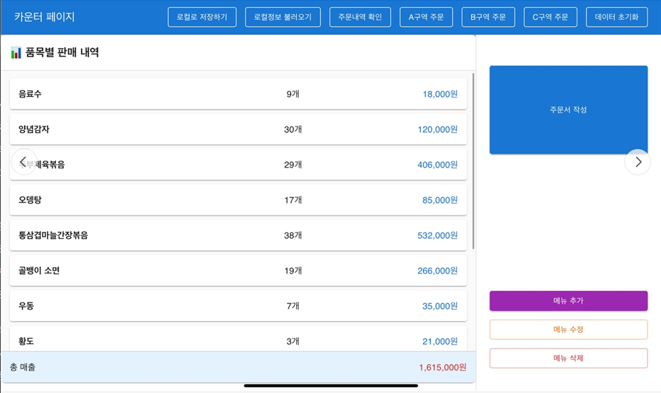

> **기능 요약**  
> - 실시간 주문 현황, 구역별 매출 요약을 한눈에 확인  
> - A/B/C 구역별로 주문 상태를 분리 표시  
> - 실시간 WebSocket으로 주문 및 서빙 현황 동기화  

---

### 주류 조회 페이지 
<p align="center">
  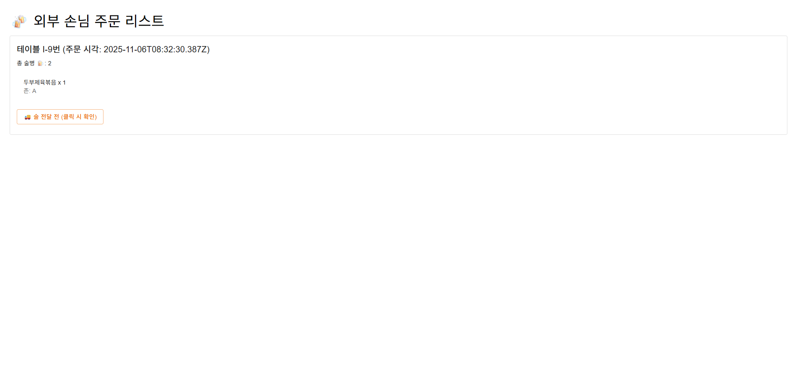
  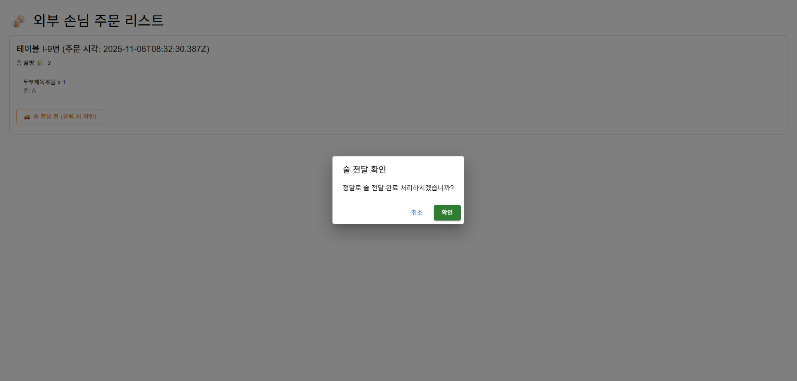
</p>

> **기능 요약**  
> - 외부인이 주문했을때 주류 수령 부스에서 조회 및 배부 할 수 있도록 정보를 제공  
> - 카운터에서 주문서가 작성되면 socket통신을 통해 해당 주문을 통해 외부인이 몇병의 주류를 수령할 수 있는지 확인 가능  

---

### 주문서 작성 페이지
<p align="center">
  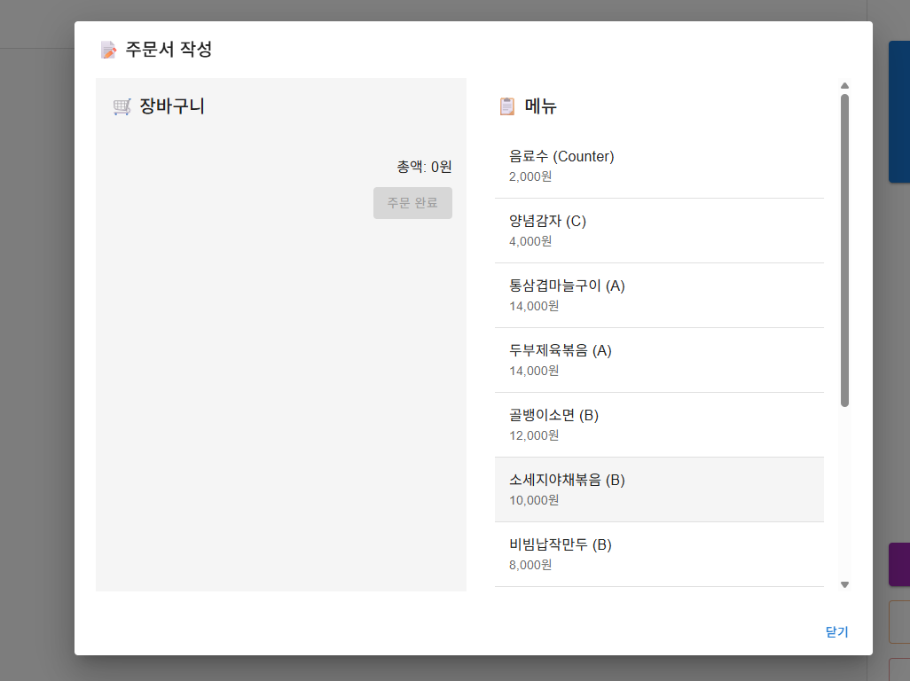
</p>

> **기능 요약**  
> - 주문서 작성 Modal
> - 오른쪽에 메뉴를 클릭하여 장바구니에 담을 수 있음


---


<p align="center">
  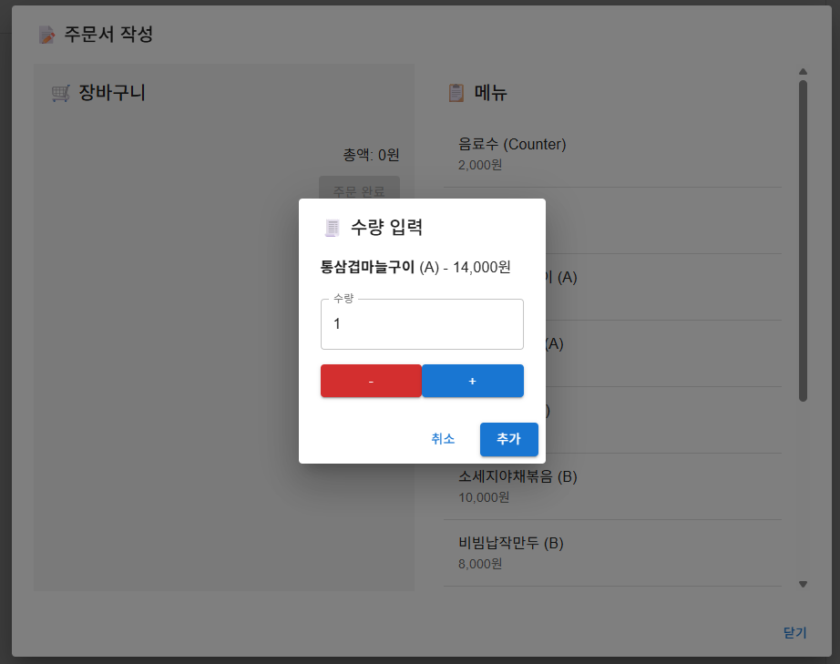
</p>

> **기능 요약**  
> - 메뉴를 클릭했을때 수량을 조절 가능
> - +,-버튼 혹은 직접 입력하여 수량을 조절 가능


---


<p align="center">
  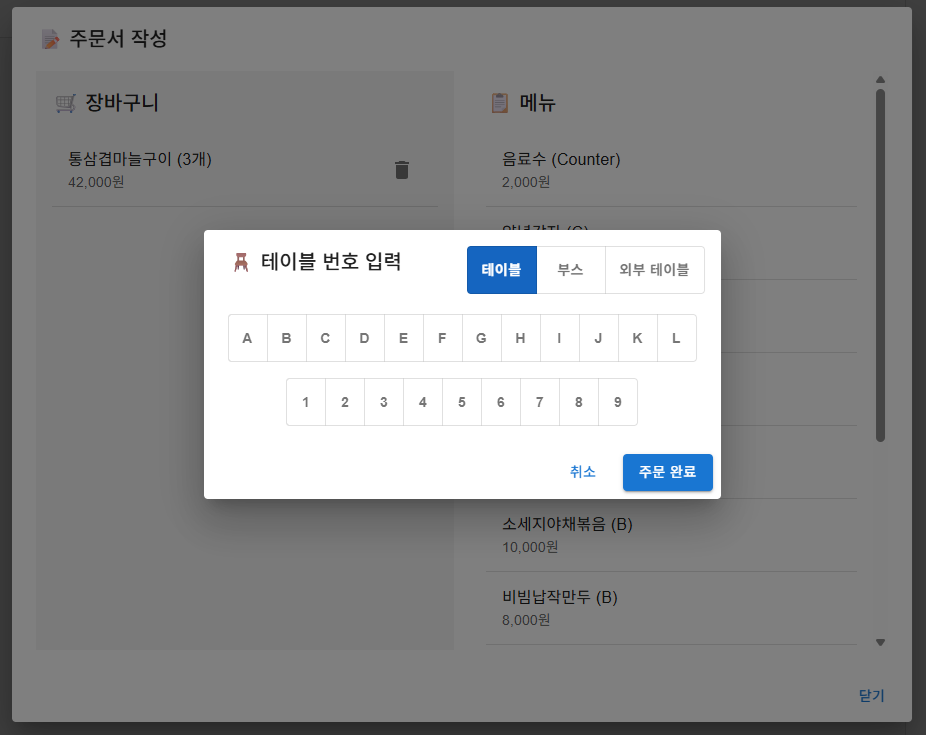
  
  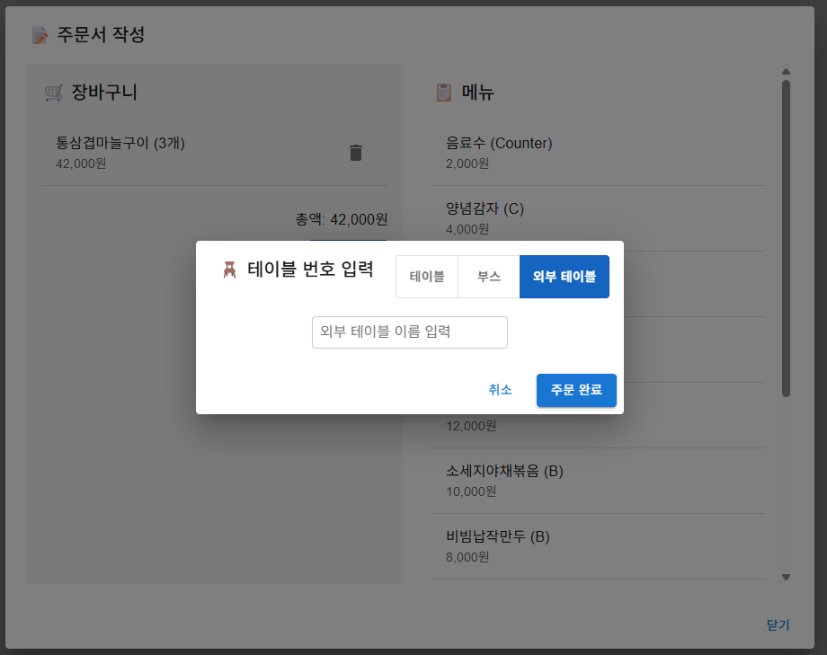
</p>

> **기능 요약**  
> - 서빙을 받을 위치를 정할 수 있음
> - 일반 테이블, 혹은 부스, 이외 예외처리를 위한 외부 테이블창에서 자세하게 입력가능


---

<p align="center">
  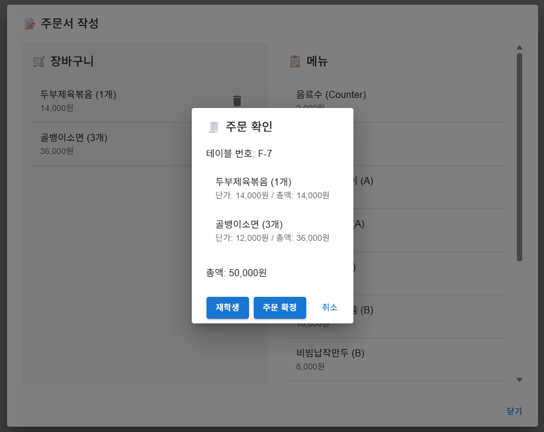
  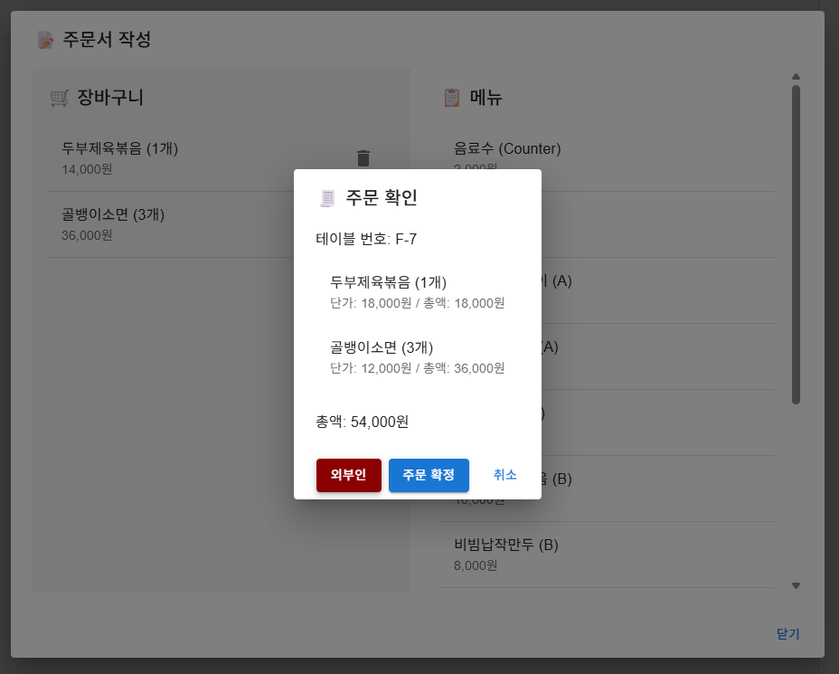
</p>

> **기능 요약**  
> - 가격은 재학생,외부인에따라 가격 측정이 다름
> - 외부인일 경우 socket을 통해 주류 수령 페이지로 정보를 넘김
> - 주문 확정시 socket을 통해 각 부스에 조리할 음식 정보를 보냄

---

### 조리 페이지
<p align="center">
  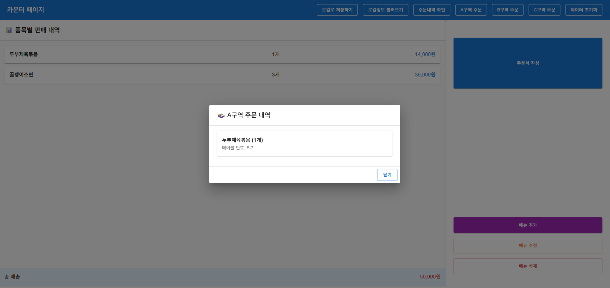
  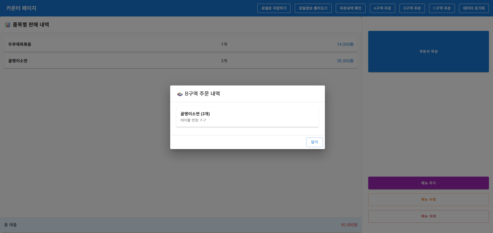
</p>

> **기능 요약**  
> - A,B,C구역이 현재 어떤 요리를 조리중인지 확인 가능


---


<p align="center">
  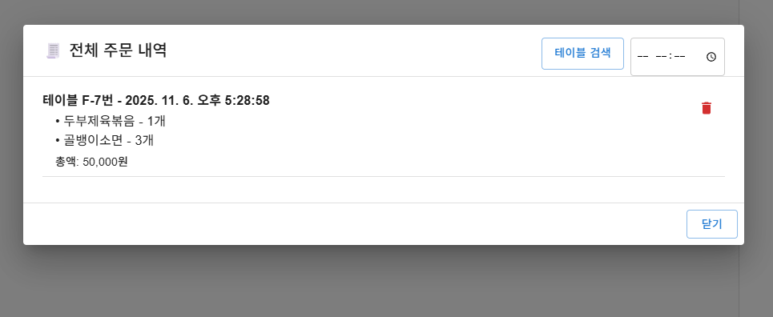
  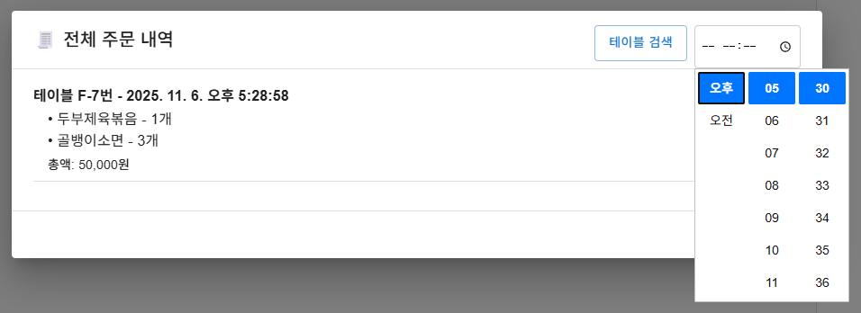
  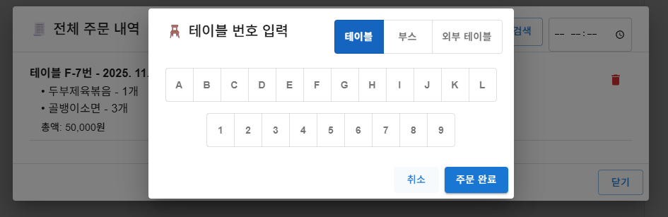
</p>

> **기능 요약**  
> - 지금까지의 주문내역을 조회가능
> - 테이블 및 시간으로 상세 조회 가능
> - 주문을 잘못넣었을경우 취소를 통해 조리구역에 넘어간 정보를 회수 가능


---


### 조리 / 서빙 페이지
<p align="center">
  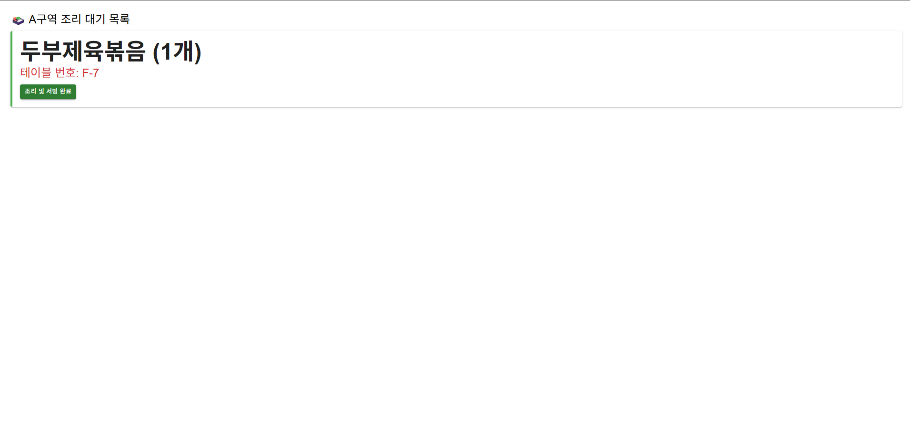
  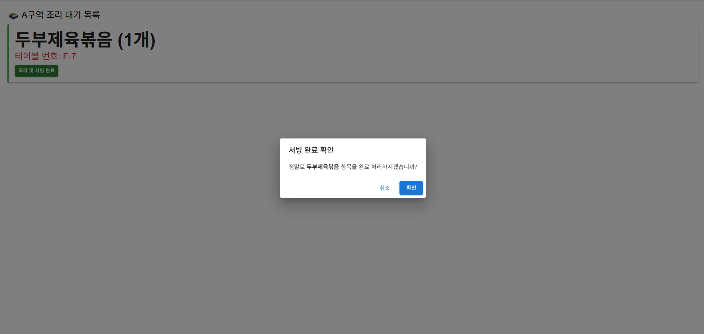
</p>

> **기능 요약**  
> - 조리구역에서 실시간 주문 목록 확인  
> - 서빙 완료 시 `socket.emit("orderServed")`로 모든 구역에 상태 전파  
> - 각 구역의 완료 상태를 즉시 반영  

---

## 기술 스택
| 구분 | 기술 |
|------|------|
| Frontend | React, MUI, Axios, WebSocket |
| Backend | Node.js Express, Socket.io |
| 배포 | GitHub Pages (Frontend), Render (Backend) |

---

## 요약
> 본 시스템은 축제 현장에서의 주문·조리·서빙 과정을 실시간으로 연결하는 통합 주문 관리 프론트엔드입니다.  
> 구역별 대시보드와 실시간 소켓 동기화를 통해 운영 효율을 극대화했습니다.
